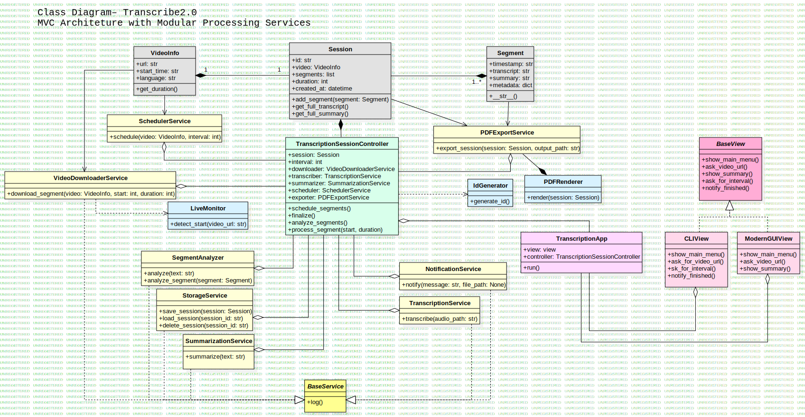

# Transcribe2.0

A modular, scalable and fully local transcription system for summarizing long YouTube videos, lectures and symposiums. Built using Python, Whisper and HuggingFace, it follows a clean MVC architecture with service layers and offline capabilities.

---

## 🚀 Overview

Transcribe2.0 allows you to process long-form video content without watching it. You can input a live or recorded YouTube link, define a time interval, and receive a final PDF with summarized segments.

Perfect for:
- Long academic events
- Lecture series
- Webinars or symposiums

---

## 🧠 Features

- 🎙️ Local transcription using Whisper
- ✂️ Automatic segmentation (10–20 min blocks)
- 🧾 Summarization via HuggingFace models
- 🧠 Emotion & metadata analyzer per segment
- 📦 Export to clean PDF reports
- ✅ Fully offline (no external APIs required)
- 💡 CLI and GUI interface ready (modular)
- 📚 JSON session storage

---

## 🏗️ Architecture

The project uses a **clean MVC pattern** + **service layer**, with separation of models, services, views and utilities.

- `model/` – domain classes: Session, Segment, VideoInfo
- `services/` – modular logic units (transcription, summarization, storage, etc.)
- `view/` – CLI and GUI interfaces, with shared BaseView
- `controller/` – orchestrates all services
- `export/` – PDF rendering and session exporting
- `utils/` – helpers like ID generation and live detection

> 📎 See UML diagram below for full structure.
## 🧬 UML Diagram



---

## ⚙️ How It Works

1. User inputs a YouTube link and chooses a time interval
2. The system downloads video/audio in small chunks
3. Each segment is transcribed with Whisper
4. Text is summarized and analyzed
5. At the end, a PDF report is generated and saved

---

## 🛠️ Setup

```bash
# Clone the repository
git clone https://github.com/byasinn/Transcribe2.git
cd Transcribe2

# Create virtual environment
python -m venv .venv
source .venv/bin/activate     # or .venv\Scripts\activate on Windows

# Install dependencies
pip install -r requirements.txt

# Run CLI version
python src/transcription_app.py
